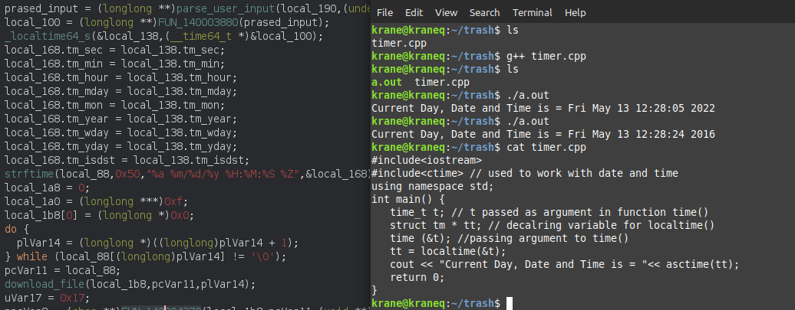
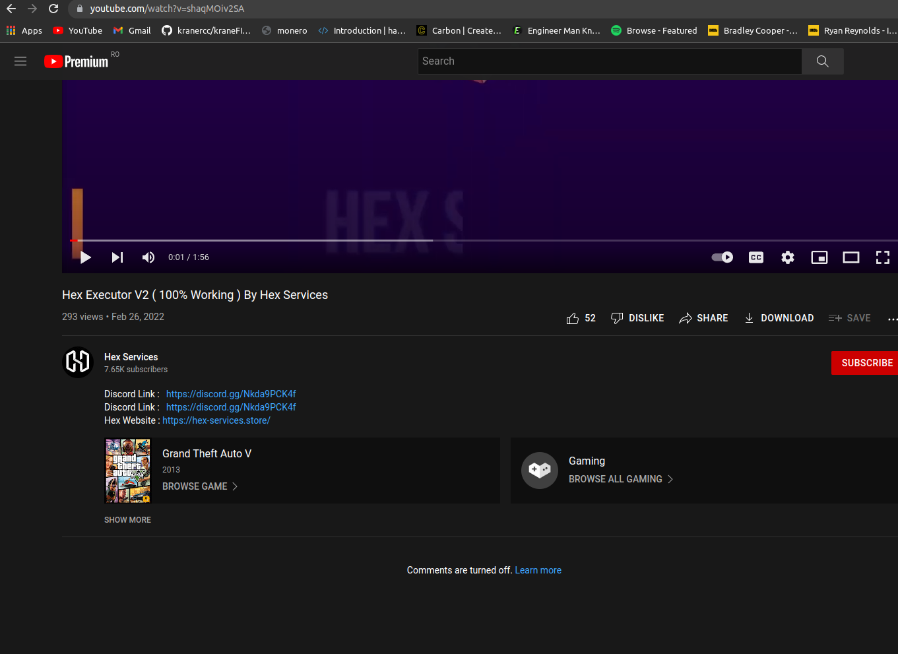
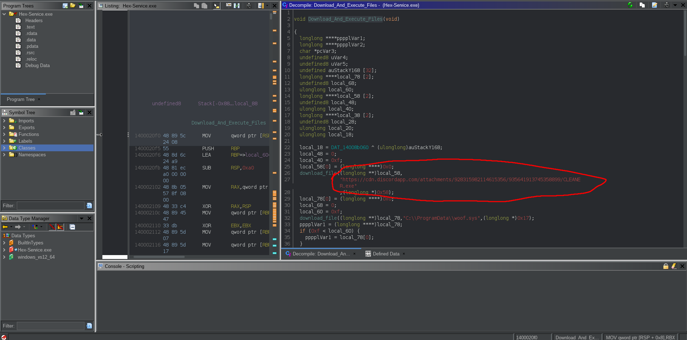
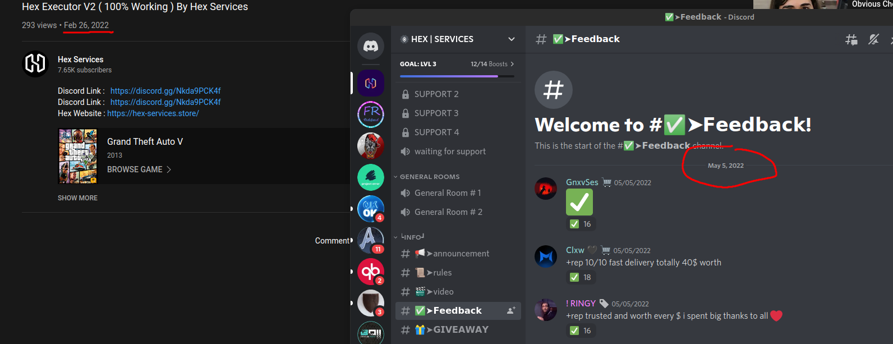

# The Trash that is Hex-Services

TL;DR - All the scripts this human scum offers, is free on github, or leaked on other resources.

Like in [here](https://github.com/SarnaxLii/Fivem-CFX-Spoofer) - which i don't recommend since this guy is also an idiot
Or in [here](https://github.com/SarnaxLii/FiveM-Spoofer)

---
### Weird 3RD Party Downloads

1. https://cdn.discordapp.com/attachments/928315982114615356/935641913745358899/CLEANER.exe


2. https://cdn.discordapp.com/attachments/741856476062285966/753542008106254346/kdmapper1803-2004.exe 

As a small add-on to the discussion, this kdmapper is RIPPED OFF from this guy: [Github-Link](https://github.com/danielkrupinski/kdmapper-1803-2004) which is ridiculous since they flexed on voice call that "we worked for 1 year for this method"


3. https://cdn.discordapp.com/attachments/866977738607165440/929450948856799303/more.exe


--- 

### The dumb script kiddies

THEY DON'T EVEN KNOW HOW TO WAIT FOR THE PROCESS TO FINISH 😂😂

```C++
  SetCurrentDirectoryA((LPCSTR)pppplVar1);
  system("mapper woof.sys");
  Sleep(2000); // i'm such a good programmer
  system("cls");
  FUN_140001290("\n Please Wait ",pcVar3,uVar4,uVar5);
  system("Start C:\\ProgramData\\more.exe"); //maybe if i execute then wait for 40 seconds hopefully the program will be finished by then HEHE smart programmer i am hex-services too good contact us
  Sleep(40000); // look at me
```


"Man, i hope one day i will be smart enough to build my own tools, but as of now i'm just too stuupid so i use tools from windows but i tell people i build them myself HAHA im so smart"

```C++
//Display current serials
system("wmic diskdrive get Serialnumber");
system("wmic bios get Serialnumber");
system("wmic baseboard get Serialnumber");
```

HOW DO I CLEAN TRACES LIKE A PRO?

```C++
ppvVar6 = Remove_File(&local_98,"DigitalEntitlements",0x13);
ppvVar6 = Remove_File(ppvVar6,"CitizenFX",9);
```
)))))))0 AND THAT WAS IT, THIS IS HOW THEY THINK CLEANING FIVEM IS
incredible "man... we worked 1 year for this methods they are so good, they persist after windows reinstall" which is a complete lie since i had to reinstall windows due to their RAT (more on that later)


"Ok ok, let's focuse, i will now BYPASS NETWORK, let's do it"
```C++
pcVar4 = getenv("LOCALAPPDATA");
ppvVar6 = Remove_File(&local_218,"FiveM",5);
ppvVar6 = Remove_File(&local_238,"FiveM.app",9);
ppvVar6 = Remove_File(&local_e8,"cache",5);
ppvVar6 = Remove_File(&local_108,&DAT_14007ea1c,1); //basically subfiles
ppvVar6 = Remove_File(pppppvVar17,"_GTAProcess.exe",0xf);
ppvVar6 = Remove_File(pppppvVar8,"_SteamChild.exe",0xf);
ppvVar6 = Remove_File(pppppvVar17,"FiveM.exe",9);
//oh man i'm so good
```

And then basically downloads some bullshit to replace this versions or whatever. "man this took 1 YEAAAAAAR, IMAGINE THIS WAS 1 YEAR OF WORK, WE ARE SO TIRED" 
##### BUT OH WAIT, THERE IS ALREADY A GITHUB PASTE FOR MY AWESOME NETWORK BYPASS HAHAHAHAHA [Github-LInk](https://github.com/SpeedyThePaster/CFX-Bypass/blob/master/smallcock/core/trace.cpp)


"Ok guys, now let's make our SERVICE payed, we will do subscription time-based, let's implement a good algorithm, let's get the LOCAL SYSTEM time, and do calcualtions based on that"


"OH FUCK GUYS, THEY CAN ACTUALLY CHANGE THEIR TIME ON THE SYSTEM, WE ARE FUCKED"


### Other garbage they have
1. Comments are turned off for their youtube channel since they are too scared people will leave actual reviews 




2. I'll leave this here so they don't say "nice, scripts Hex-Services.exe | grep *.exe" 
   


3. Discord channel remove, or feedbacks removed. which if discord removed their channel you can guess why that was 😂


4. Even their website is suspended
   


They even lie on the voice calls, teling me that "yea man, this persist after WINDOWS reinstall, this is that thing we worked on the most man" and it doesn't even work 😂😂


buy yea, they really did work on this trash for 1 year. 
